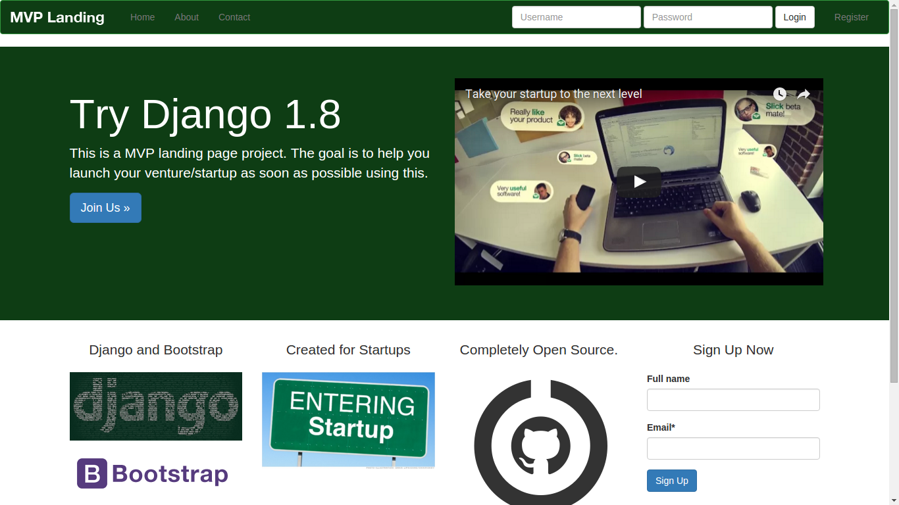
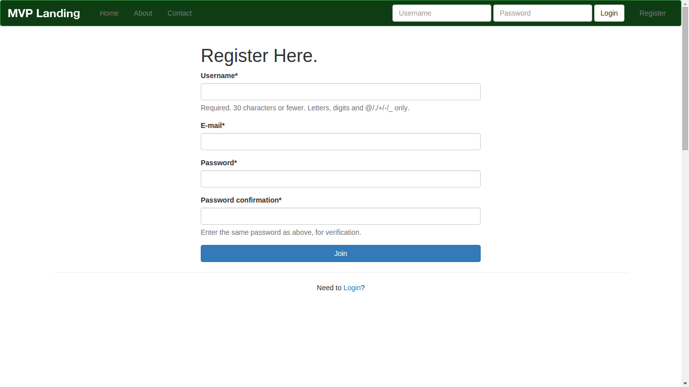
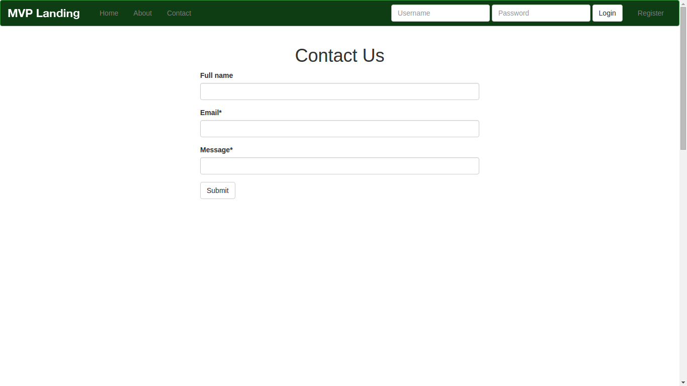

<h1>Django Landing Page</h1>

A landing page created using Django 1.8 and bootstrap 3.

Third party packages used:
<ul>
	<li>Crispy Forms</li>
	<li>Django Registration Redux</li>
	<li>Font Awesome</li>
</ul>

Screenshots:

